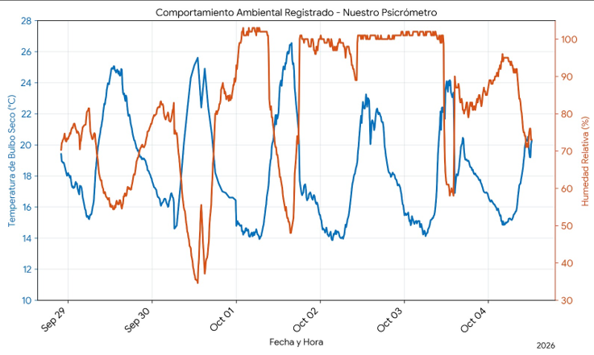
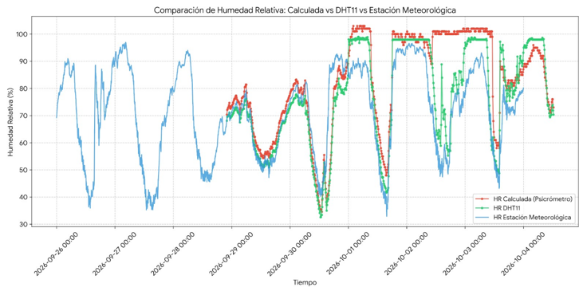
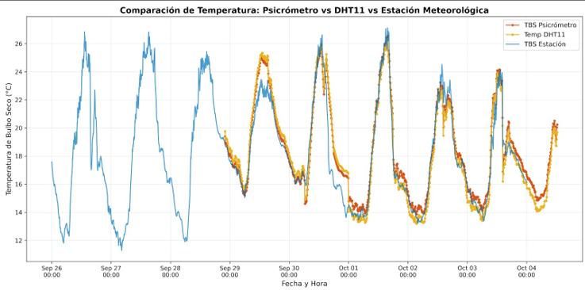
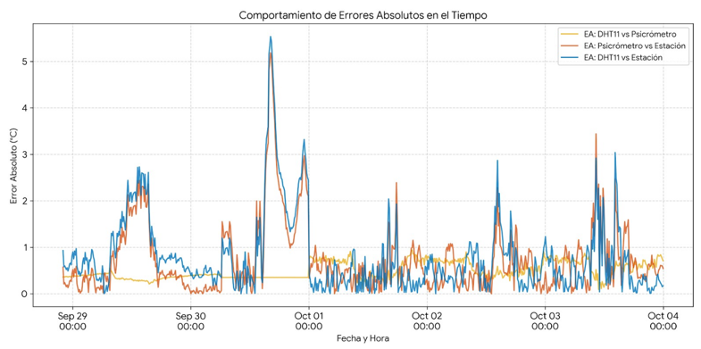
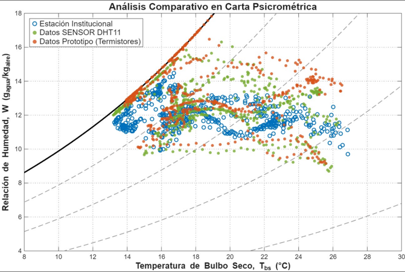

# 🌦️ Estación Psicrométrica Digital Inalámbrica (ESP32 + CYD)

<p align="center">
  
  
  
  
  <br>
  
  
  
  
</p>

**Automatización de Biosistemas | Ingeniería Mecatrónica Agrícola**

Este repositorio contiene el código fuente (para ambos nodos) y la documentación técnica de una **Estación Psicrométrica de alta precisión**. El sistema captura, calcula, transmite y almacena variables termodinámicas del aire utilizando el modelo matemático de ASHRAE y una arquitectura IoT de doble núcleo.

---

---

## 📈 Resultados y Validación en Campo

Para garantizar la fiabilidad del instrumento, se validaron los cálculos del psicrómetro digital contrastándolos simultáneamente con un sensor **DHT11** y con los registros de una **Estación Meteorológica Institucional (CR1000)** del Laboratorio de Biosistemas.

### 1. Comportamiento Ambiental y Detección de Anomalías

> **Análisis:** Durante la evaluación se identificó una anomalía crítica entre el 2 y el 3 de octubre. La Humedad Relativa se clavó en un estado de saturación irreal (100%), mientras la Temperatura de Bulbo Seco oscilaba naturalmente entre 14 °C y 23 °C. 
> **Diagnóstico:** Pérdida del cedazo húmedo por evaporación e interrupción capilar. Al secarse el termistor, la depresión de bulbo húmedo ($T_{bs} - T_{bh}$) fue igual a cero, forzando a los algoritmos ASHRAE a interpretar matemáticamente una saturación total.

### 2. Comparativa de Humedad Relativa

> El psicrómetro y el DHT11 muestran un acoplamiento estrecho con la estación institucional en condiciones de humedad baja y media (~35% a 75%). A partir de la falla del cedazo el 1 de octubre, se registra una saturación errónea del 100% en el prototipo, fenómeno que también afectó al DHT11 llevándolo a su límite instrumental (~98%), mientras la estación de referencia se mantenía por debajo del 90%.

### 3. Seguimiento Térmico (Bulbo Seco)

> La Temperatura de Bulbo Seco presenta un seguimiento térmico prácticamente idéntico entre los tres sistemas, con variaciones naturales del ciclo diurno (12 °C a 27 °C). Las divergencias menores se observan únicamente durante los picos de calor máximo, donde los termistores NTC expuestos en la cámara del psicrómetro captan las variaciones convectivas más rápido que el encapsulado de la estación comercial.

### 4. Análisis de Errores Absolutos y Precisión


El error absoluto confirma la alta fidelidad de la arquitectura electrónica. La divergencia frente al equipo comercial ocurre mayormente en picos puntuales, pero mantiene promedios sumamente competitivos para la automatización agrícola.

| Comparativa de Sensores | Error Absoluto Medio | Error Absoluto Máximo | Error Relativo Medio |
| :--- | :---: | :---: | :---: |
| **DHT11 vs Psicrómetro** | 0.49 °C | 0.94 °C | 2.82 % |
| **Psicrómetro vs Estación** | 0.74 °C | 5.19 °C | 4.14 % |
| **DHT11 vs Estación** | 0.81 °C | 5.54 °C | 4.47 % |

### 5. Proyección en Carta Psicrométrica

> El análisis termodinámico proyectado a 2250 msnm sintetiza visualmente el impacto del fallo mecánico. Mientras la nube de datos de la Estación Institucional (azul) y el DHT11 (verde) siguen trayectorias coherentes dentro de la zona operativa del aire, la franja de datos del Prototipo (naranja) colapsa sobre la línea de saturación ($100\%$ HR). Esta firma gráfica permite aislar de manera visual los datos erróneos correspondientes al periodo sin humectación.

## ⚙️ Arquitectura del Sistema

El proyecto opera bajo un modelo de comunicación inalámbrica de baja latencia utilizando el protocolo **ESP-NOW**. Todo el software está desarrollado en **C++** sobre el framework de Arduino, utilizando tareas en paralelo mediante **FreeRTOS** para evitar cuellos de botella en la memoria y en la interfaz visual.

### 📡 1. Nodo Emisor (Adquisición y Cálculo)
* **Hardware:** ESP32 (Dev Board) + 2x NTC 10K (B3435) sumergibles + DHT11.
* **Función:** Tarea fijada al núcleo 1 de la ESP32 para lectura de sensores cada 2 segundos mediante un circuito **Pull-Down** (NTC a 3.3V, R fija a GND). 
* **Procesamiento:** Implementa la **Ecuación de Steinhart-Hart** con un ajuste lineal de calibración a dos puntos y ejecuta algoritmos psicrométricos de la ASHRAE para deducir propiedades físicas del aire.
* **Transmisión:** Empaqueta 15 variables en un `struct` sincronizado y las envía al nodo receptor.

### 🖥️ 2. Nodo Receptor (Interfaz y Datalogger)
* **Hardware:** Pantalla táctil CYD (Cheap Yellow Display - ESP32) + Módulo RTC DS3231 + Tarjeta microSD.
* **Función:** Recibe telemetría vía ESP-NOW y dibuja gráficas fluidas utilizando la librería gráfica **LVGL** y UI generada.
* **Almacenamiento:** Cada 10 minutos recibe el paquete de promedios, inyecta una marca de tiempo exacta (YYYY/MM/DD HH:MM:SS) mediante el RTC, y escribe el historial en un datalogger `.csv` directo a la microSD.

---

## 📊 Variables Psicrométricas Calculadas (Modelo ASHRAE)

El firmware del nodo emisor está programado para calcular las siguientes propiedades bajo la presión atmosférica local de Texcoco (77 kPa a 2250 msnm):

- Presión de Saturación de Vapor (Pvs)
- Presión Real de Vapor (Pv)
- Déficit de Presión de Vapor (DPVa)
- Razón de Humedad (W y Ws)
- Humedad Relativa calculada matemáticamente (μ)
- Volumen Específico del aire húmedo (Veh)
- Entalpía (h)
- Temperatura de Punto de Rocío (Tpr)

---

## 🔌 Esquema de Conexiones (Pinout)

### Nodo 1: Sensores (ESP32)
| Componente | Pin ESP32 | Configuración |
| :--- | :--- | :--- |
| **NTC Bulbo Seco** | `GPIO 35` (ADC) | Divisor de tensión Pull-Down (10kΩ a GND) |
| **NTC Bulbo Húmedo**| `GPIO 34` (ADC) | Divisor de tensión Pull-Down (10kΩ a GND) |
| **DHT11 (Referencia)**| `GPIO 23` | Señal de datos (Pull-Up interno o 10kΩ a VCC) |

### Nodo 2: Interfaz (Pantalla CYD)
| Componente | Pin CYD | Función |
| :--- | :--- | :--- |
| **RTC DS3231 (SDA)**| `GPIO 22` | Comunicación I2C |
| **RTC DS3231 (SCL)**| `GPIO 21` | Comunicación I2C |
| **Módulo MicroSD** | `Integrado` | SPI a 4MHz (Pin CS: `GPIO 5`) |

---

## 💾 Formato de Salida (Datalogger CSV)

Los registros de la tarjeta microSD generan una tabla `.csv` lista para su análisis y graficación en Excel o Python. Incluye validación contra el sensor de referencia (DHT11).

```csv
Fecha,Hora,Tbs,Tbh,Pvs,Pv,DPVa,W,Ws,HR_Calc,Veh,Entalpia,Tpr,Temp_DHT11,HR_DHT11
2026/10/04,14:30:00,22.15,18.50,2.66,2.01,0.65,0.012,0.015,75.50,0.92,54.20,17.50,22.30,76.00
